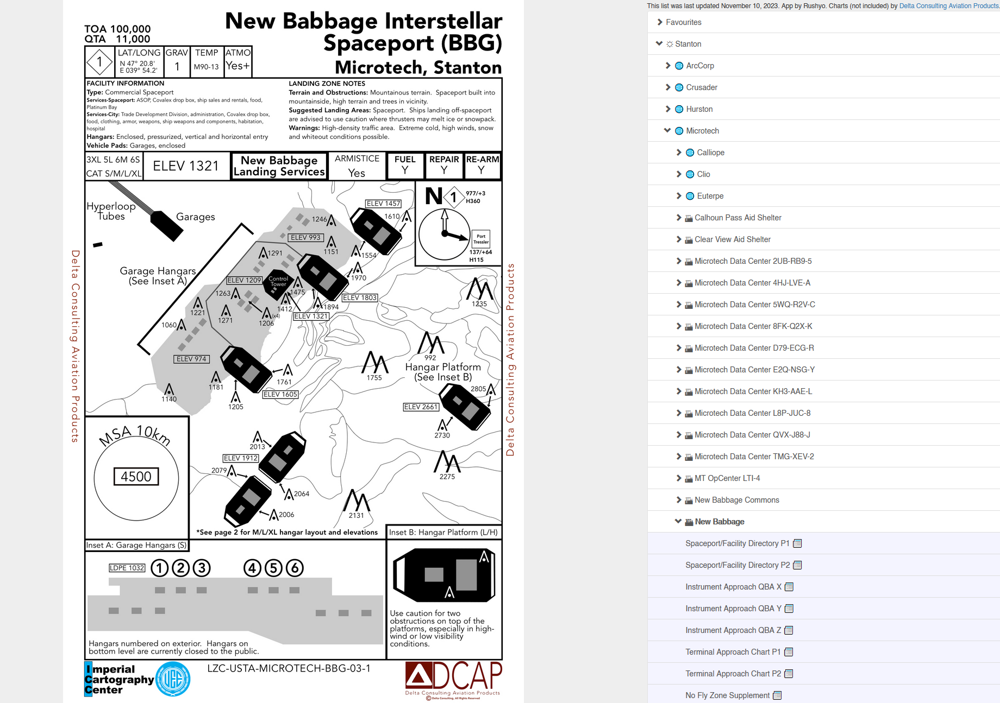

# CitChart - Star Citizen Navigation Chart Viewer

This single HTML page provides a simple interface to quickly access Star Citizen [navigation charts](https://www.deltaconsultingsc.com/aviation-products) provided (separately) by [Delta Consulting Aviation Products](https://www.deltaconsultingsc.com/aviation-products):



To use it, simply drop the `citchart.htm` file in a local folder, then create a 'data' folder in the same folder and place [the charts](https://www.deltaconsultingsc.com/aviation-products) from [Delta Consulting Aviation Products](https://www.deltaconsultingsc.com/aviation-products) in the following folder structure:

```
./citchart.htm
./data/2-Stanton SFD/
./data/3-Stanton No Fly Zone Supplement/
./data/4-Stanton Terminal Area Chart Supplement/
./data/5-Stanton Instrument Approach Procedure Supplement/
```

Open `citchart.htm` in your web browser to access. Tested with Fx and Edge on Windows.

This application is not affiliated with Delta Consulting Aviation Products and provides independent functionality.

Copyright © 2023 Danny 'Rushyo' Moules. A public license is provided to perform and display the application for non-commercial purposes. All other rights reserved. 